# SentinaAI — Smart Venue Intelligence Platform

> **Capstone Project** · University of Wollongong in Dubai · CSIT321 · Team Cyber6  
>  Grade: 85 (High Distinction) · Developed Sep 2025 – Mar 2026

SentinaAI is a full-stack edge–cloud platform built to transform how large convention centres are monitored, managed, and optimised. It unifies IoT-connected systems, edge processing, cloud analytics, AI-driven anomaly detection, and role-based dashboards into one coordinated environment — giving operations managers, SOC analysts, sustainability managers, and exhibitors complete real-time visibility and control.

The system was built to address a real problem: large venues generate massive volumes of data from cameras, HVAC systems, occupancy sensors, and environmental monitors, yet this information is typically scattered across disconnected systems with no unified intelligence layer. SentinaAI brings it all together.

---

## What It Does

- **Real-time IoT monitoring** across 26 hall zones, processing live telemetry from CCTV, HVAC, occupancy sensors, and environmental monitors
- **AI-powered anomaly detection** using a RandomForest-based pipeline that classifies security and operational threats, triggers role-routed alerts, and propagates crowd surge simulations across adjacent zones
- **Predictive occupancy forecasting** using ML models to anticipate crowd distribution and support proactive resource allocation
- **Sustainability intelligence** tracking energy consumption, carbon emissions, and HVAC efficiency per zone with AI-generated optimisation recommendations
- **Exhibitor analytics portal** with booth-level visitor heatmaps, dwell time analysis, engagement scoring, and exportable reports
- **3D Digital Twin** of the venue with live colour-coded overlays for occupancy, CO₂, energy, and anomaly states — plus history playback and sandbox simulation modes
- **Crowd-aware indoor navigation** using Dijkstra pathfinding weighted by live occupancy data, with real-time rerouting around congested zones
- **Rule-based analytics assistant** (Senti) with role-specific guided flows for operations, sustainability, and exhibitor users
- **Role-based dashboards** for Operations Managers, SOC Analysts, Sustainability Managers, Exhibitors, and Super Admins — each scoped to their domain

---

## My Contributions

This was a 6-person capstone team project. My specific contributions:

- **Co-led project development** - coordinated deliverables, tracked progress across the team, and kept system design decisions aligned with implementation throughout the full development cycle
- **AI detection service** - contributed to building the anomaly detection pipeline, working on the RandomForest classification logic, threshold-based rule engine, and the spillover propagation that cascades crowd surge alerts across adjacent venue zones
- **Data pipelines and PostgreSQL architecture** - contributed to designing the multi-database schema across `sentina_core`, `sentina_telemetry`, `sentina_analytics`, and `sentina_sustainability`, and helped build the ETL workflows connecting edge telemetry to cloud analytics
- **Predictive occupancy forecasting** - integrated ML models that forecast crowd distribution and venue occupancy, with predictions surfaced directly on live operational dashboards so staff could act on them in real time
- **IoT dataset processing** - handled data cleaning, preprocessing, and feature engineering for sensor telemetry across 26 hall zones, combining statistical analysis with ML outputs to generate actionable operational insights
- **Dashboard KPI integration** - connected ML model outputs to real-time dashboard views across the operations and sustainability modules, enabling live decision-making from IoT-driven data
- **Documentation lead** - served as the primary technical writer for the project, leading documentation across the Software Requirements Specification, System Design Document, and Test Plan covering all 197 functional requirements

---

## Architecture

SentinaAI runs on a hybrid edge–cloud architecture. At the edge, a Raspberry Pi processes local telemetry and runs inference using a people-counting model. In the cloud, GCP Cloud Run hosts seven microservices that handle analytics, AI inference, report generation, navigation, and the assistant.

```
IoT Edge Devices → MQTT Broker (EMQX, mTLS) → AI & Navigation Services → Dashboard Backend → Frontend
```

| Component | Purpose | Tech |
|---|---|---|
| Main Dashboard | Role-based web UI | React 18, Vite |
| Dashboard Backend | API gateway, auth, data aggregation | Node.js, Express |
| AI Detection Service | IoT anomaly detection and classification | FastAPI, scikit-learn |
| Exhibitor AI Pipeline | Booth visitor analytics and forecasting | FastAPI, PyTorch |
| Digital Twin | 3D venue visualisation | React 18, Three.js |
| Navigation Web | 2D crowd-aware indoor pathfinding | Flask, PixiJS |
| Report Export Service | PDF and Excel report generation | FastAPI, pdfkit |
| MQTT Broker | Secure IoT device messaging | EMQX 5.8, Docker |

---

## Dashboards

### Operations Dashboard
Full venue operational visibility — live occupancy across 26 halls, device health, active alerts, event management, exhibitor and booth tracking, and access to the navigation map and digital twin.

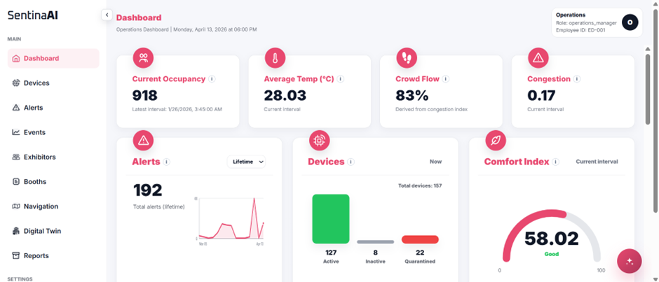

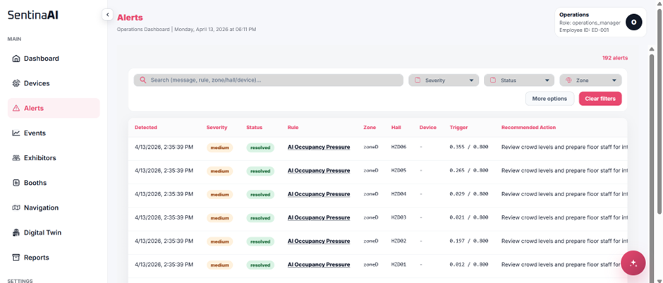

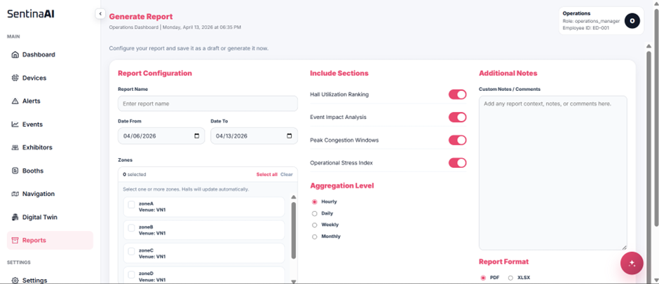

### Sustainability Dashboard
Energy and environmental monitoring — per-hall energy consumption, carbon footprint tracking, HVAC efficiency scoring, CO₂ and comfort metrics, and AI-generated optimisation recommendations.

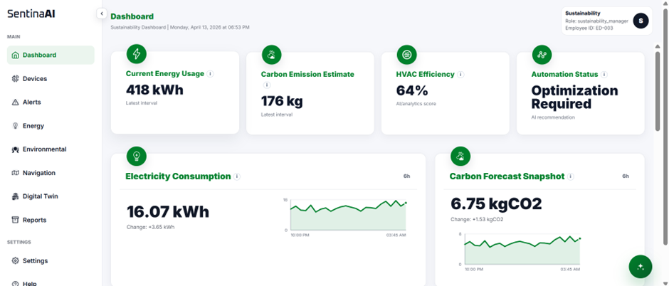

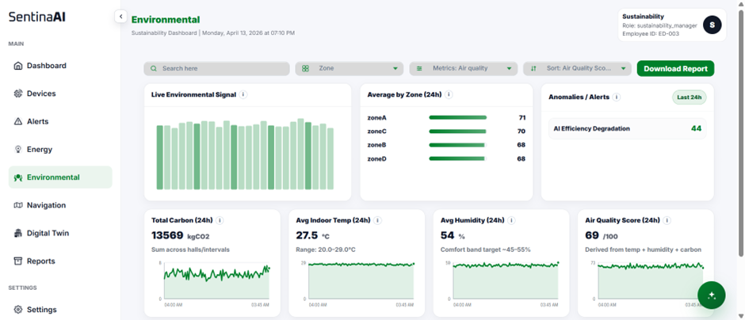

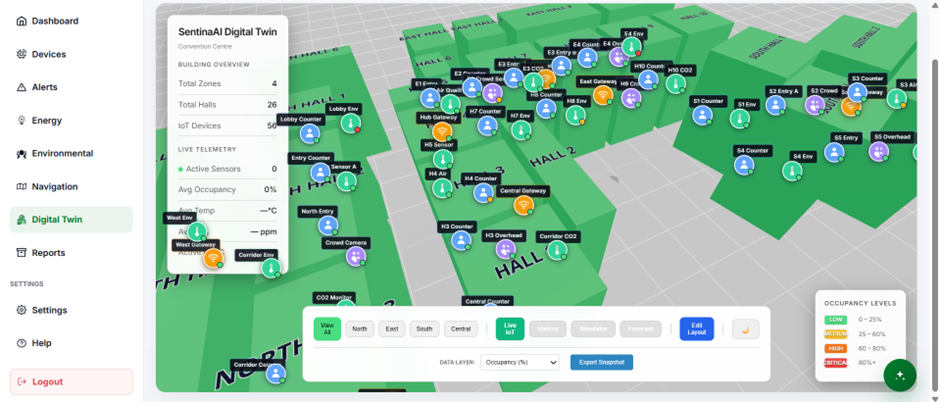

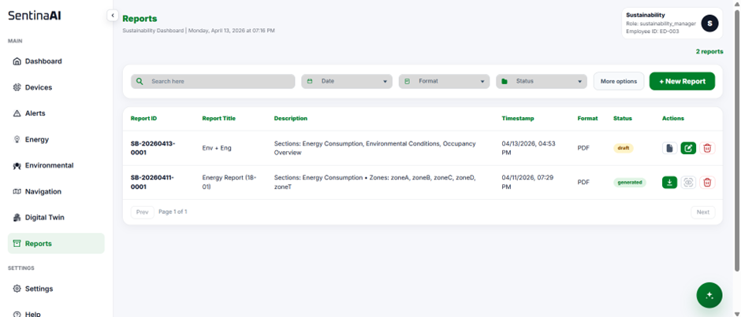

### Exhibitor Portal
Booth-level analytics — visitor density heatmaps, dwell time, engagement confidence scoring, historical comparison charts, and exportable PDF and Excel reports.

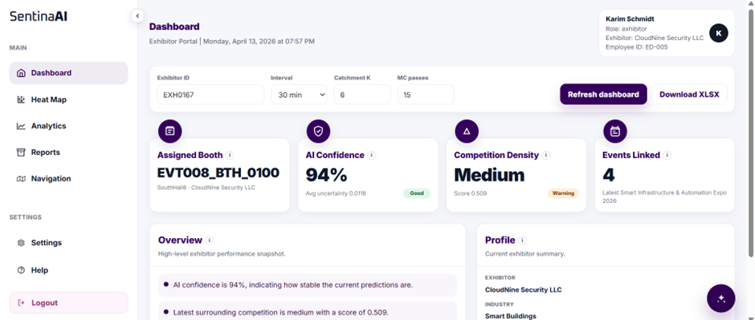

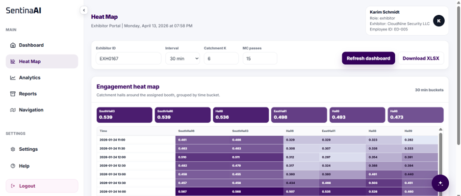

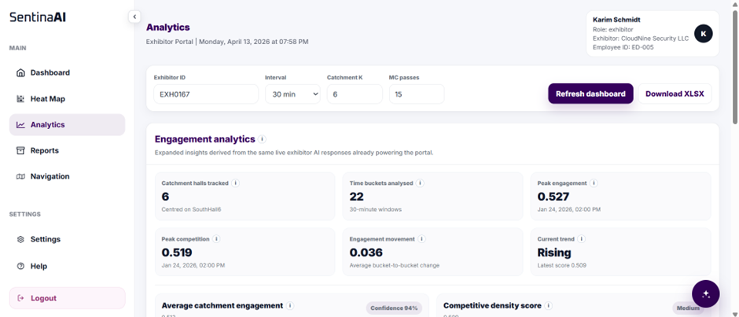

### SOC Dashboard
Security operations centre view — AI-generated anomaly alerts classified by severity and type, threat trend analytics, security logs, and a quarantine KPI tracking compromised devices.

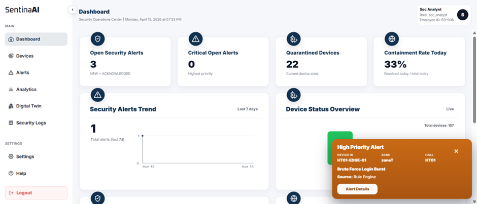

---

## Tech Stack

**Frontend:** React 18, Vite, Three.js, PixiJS  
**Backend:** Node.js, Express, FastAPI, Flask  
**AI/ML:** scikit-learn, PyTorch, YOLOv8, HuggingFace  
**Databases:** PostgreSQL (7-schema architecture), MongoDB  
**Infrastructure:** GCP Cloud Run, Docker, Kubernetes  
**IoT:** EMQX MQTT broker, Raspberry Pi, mTLS  
**Other:** JWT authentication, TOTP MFA, GDPR compliance endpoints  

---

## Key Results

- Anomaly detection pipeline achieved **≥85% precision** target with compound threshold design limiting false positives
- Digital twin renders **26 hall zones** at **24 FPS** with live telemetry updates every 5 seconds
- System processes **≥500 MQTT messages/second** under normal operational load
- Deployed across **7 GCP Cloud Run services** with **99.9% uptime** during the demo period
- Passed **197 functional requirements** across IoT integration, edge intelligence, cloud analytics, AI detection, dashboards, sustainability, exhibitor interfaces, and data governance

---

## Academic Context

Developed as the capstone project for CSIT321 at the University of Wollongong in Dubai. The scope deliberately extends beyond standard coursework requirements to explore production-grade system design, cloud deployment, and real-world IoT integration. The project received a High Distinction grade.
